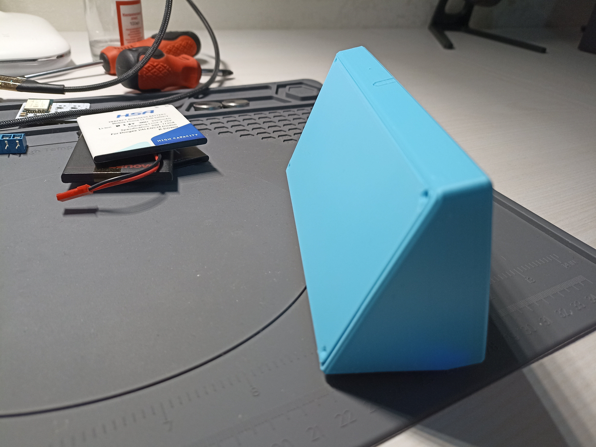

# Lilygo T5 Pro Informer for Home Assistant
This repository contains all my relevant materials, configurations and information used at building a Lilygo T5 Pro Informer for Home Assistant, based on ESP32-S3 module.

This project came to life mainly because I wanted to try the ePaper technology and check it out by myself. 
Initially I wanted to buy a bare display and make the electronics myself but I saw the Lilygo module and decided it is going to be faster to just buy it. 

At the moment of the build I had quite some trouble compiling it with ESPHome because the esp32-s3 was not fully supported at that time. As a result I had to to some digging on the internet to find a solution. 

## ESPHome Configuration File
The ESPHome yaml configuration file is `Configuration/t5_informer.yaml`. All the parameters are explained in the file.

You will notice that there are a bunch of repetitive sensors passed from HA to ESPHome for temperature forecast and event display. This is a workaround that I used to display the mentioned information since I could not manage to parse the JSON on the device itself... Any improvement here is welcome!

## ESPHome Compilation problems
As mentioned above, I had some problem compiling this project for esp32-s3 and after an extensive google search I found [this](https://github.com/esphome/feature-requests/issues/1960) feature request related to exactly Lilygo T5 Plus board.

I have folowed [this](https://github.com/esphome/feature-requests/issues/1960#issuecomment-1426388167) advice and added the file `Configuration/lilygo-t5-47-plus.json` to my device directory in `/config/esphome/.esphome/build/[my-device-name]/boards` and in the configuration file I specified the board as `lilygo-t5-47-plus` which worked like a charm and after all the manipulations I was able to flash the board and have it displaying my first letters on an ePaper display. :)

## Display Layout Configuration file
As you can observe in the ESPHome configuration file, the display layout code is in a different file and you can find it in `Configuration/t5_resources/my_display.yaml`.

In that file I have described all the bits and pieces that I consider important and hopefully it is explicit enough that anybody could easily change it to suit his/her needs.

The fonts and icons files are in the `Configuration/t5_resources/fonts/` don't forget to grab those and the `Configuration/t5_resources/common.h` file and add them to your desired directory in order to use when compiling the firmware. 

## Home Assistant part of configuration
To populate the weather and tasks related information I have added 2 template sensors on the home assistant side. 

I added them directly into the configuration.yaml file of the HA. Please check the file in `Configuration/HA_configuration.yaml`. It very clunky and I am aware there must be a more clever and better way to poll this info and if you know how to improve it, you are more than welcome. 

## 3D Print files for case
I have also designed a case for this specific board and the files to 3D print it are in the `3D_Files` directory. 

I printed it using PLA and designed the model to be printed without any support. 

[Here](https://cad.onshape.com/documents/7d4a7958a10177a50d182324/w/5a86303ea5b0b907208ba287/e/458f4cf96e62d17cedf1597b) if the link to the onshape project with the case. You can copy the project and add any changes and improvements you add because even though it is good enough for me, it is definitely far from being perfect and any improvement is welcome. 

**NOTE:** Please compile the firmware, flash it via USB and be sure the device is working and connecting to ESPHome before assembling the case. Due to some design flaws when the device is assembled the USB C connector can not reach the board. Sorry for that... :( Please modify the project and fix this issue if it annoys you too much. 

## Assembly steps
### Step 1: Get the parts
In the picture below you can see all the parts I used in the end to assemble the project. Plus add some screws and heated inserts that are not seen in the photo.

### Step 2: Insert the bronze heated inserts into the case fixture points

### Step 3: Insert the Lilygo Board

Please be careful at this step because you will have to fiddle the board around a bit to place it the right spot. I didn't think this step thoroughly enough and you will have to bend the upper side of the case outwards a bit so that the back lid support does not interfere with the board when inserting it.

Again: **Please be careful** not to damage your board or the ePaper display! (I have assembled an disassembled the device not less than 5 times and didn't damage mine so it is definitely doable but if you want to improve it, please adjust the 3D model using the shared link of the case project.)

### Step 4: Add the fixtures

Use some screws compatible with your heated inserts and add the printed fixtures to secure the board and the display in place.

You can see from the photos that I trimmed my fixtures after printed because those were interfering with some components on the board but on the current model this is fixed.

### Step 5: Check the functionality

At this point you can connect a battery and check if the device turns on and if everything is fine.

### Step 6: Add a battery
Initially I wanted to use an old phone battery that I had laying around as you can see from the photo below.

After some testing it turned out that the capacity degraded too much over time and the software is not yet very optimized for low enough power consumption. As a result the battery was drained very fast. So, I decided to use an 18650 cell that you can easily find anywhere. :) 

So I found [this](https://www.printables.com/model/75343-k014s-parametric-18650-battery-holder-opensource/comments/1284600) battery holder on Printables, printed it, inserted some bronze heated inserts in a very ugly way, drilled some holes in the bottom of the case and fixed it inside.

### Step 7: Charge the battery and insert it in the holder

### Step 8: Screw the back lid in place

### Step 9: Enjoy!

## References
Working on this project I designed the case entirely from scratch. However, the software was found in other repositories and was heavily modified by me to work for my needs.
Here are the references to the repositories and articles which I used.

[ESPHome configuration example](https://gist.github.com/Plawasan/4ae826b05aaa7812f3a191714ca47a50)

[Example of common.h file for translation functions used to convert text to icons](https://github.com/tolnai/esphome-dashboard-lilygo-t5/blob/main/common.h)

[Very useful and informative video from BeardedTinker](https://www.youtube.com/watch?v=yftae61X4i8)

[Nice display layout](https://www.reddit.com/r/homeassistant/comments/sdx5gg/yet_another_lilygo_t5_eink_esphome_dashboard/)

[Another example of ESPHome configuration](https://github.com/kotope/esphome_eink_dashboard/blob/main/eink-dashboard.yaml)

[Feature request issue which helped to compile the software](https://github.com/esphome/feature-requests/issues/1960)

## Some open issues:
1. When the battery discharges I have to take the back lid off and charge it because, as mentioned above, due to my design flaw I can not reach the connector with the USB C.
2. Make it update with a smaller frequency than hourly in the night.
3. Center the Tasks in the dedicated space when there are less than 3 tasks available.